# 💬 ChatsApp — Real-Time Messaging Application (WhatsApp Clone)

A modern, full-stack real-time communication platform built with **Spring Boot 3**, **React**, **WebSockets (STOMP)**, and **MySQL 8.0**.

---

## 🌟 Features

- 🔐 **Stateless Authentication:** Secure signup and signin powered by Spring Security, JWT (JSON Web Tokens), and BCrypt password encryption.
- ⚡ **Real-Time Instant Messaging:** Low-latency bi-directional messaging with WebSockets using STOMP protocol and SockJS fallback.
- 💬 **1-on-1 & Group Chats:** Create direct messages or multi-user group conversations with custom group names and avatars.
- 🔍 **User Search:** Dynamic user search to quickly initiate new conversations.
- 📱 **WhatsApp-style Status/Stories:** Temporary user stories with animated progress bars.
- 👤 **Profile Customization:** Profile picture updates with cloud-hosted asset management via **Cloudinary**.
- 🎨 **Responsive UI:** Clean, responsive WhatsApp-inspired interface built with Tailwind CSS and Material-UI.

---

## 📸 Screenshots

| Screen | Preview |
|---|---|
| **Login Page** | 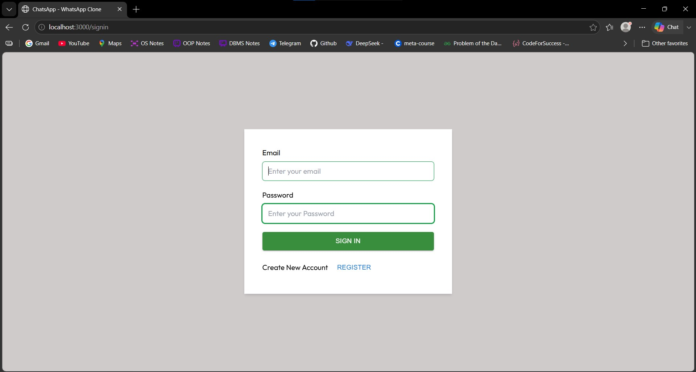 |
| **Sign Up Page** | 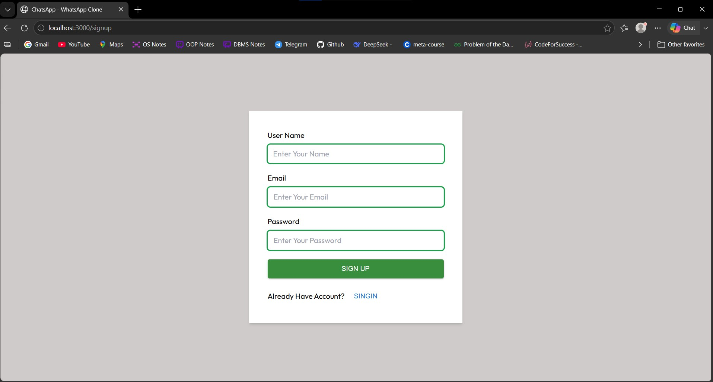 |
| **Main Chat Interface** | 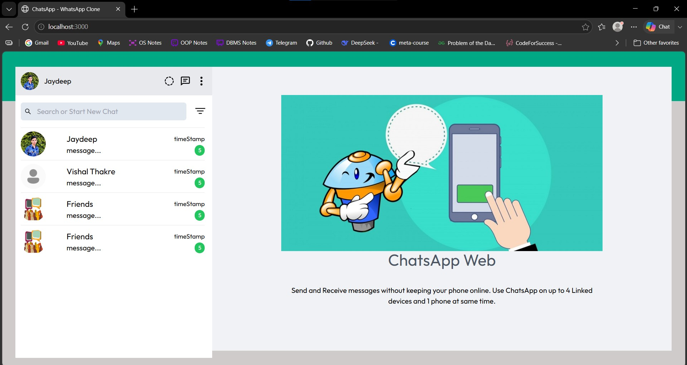 |
| **1-on-1 Chat Messaging** | 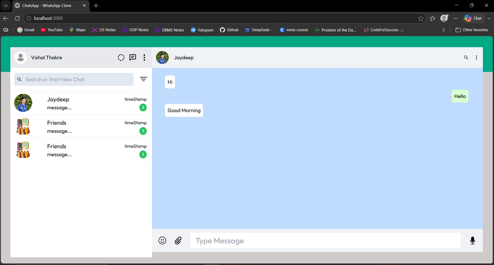 |
| **Active Chat View** | 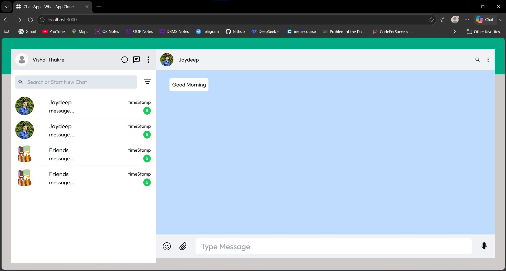 |
| **Create Group Chat** | 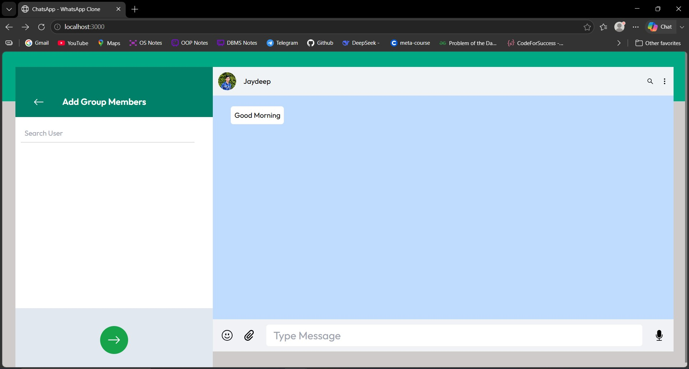 |
| **Add Members to Group** | 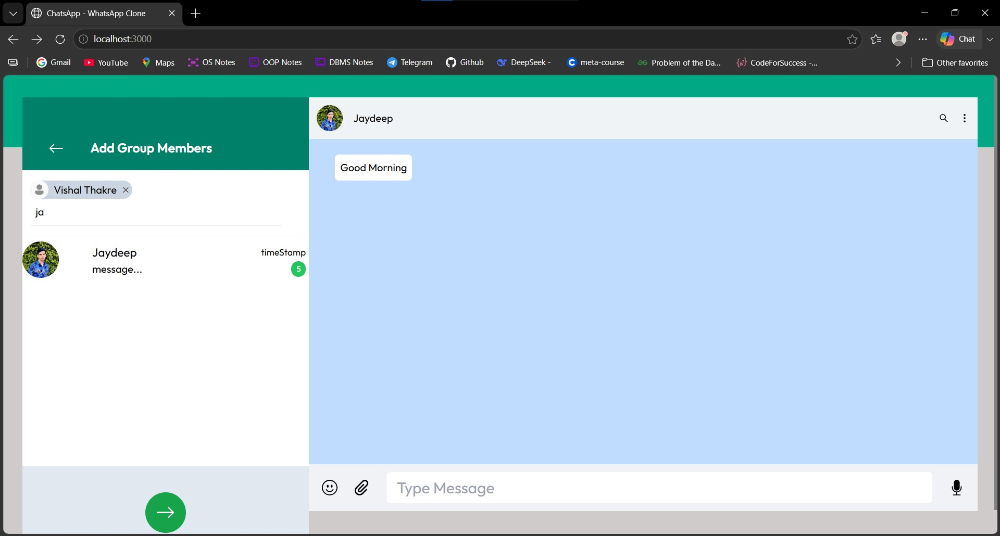 |
| **Set Group Avatar** | 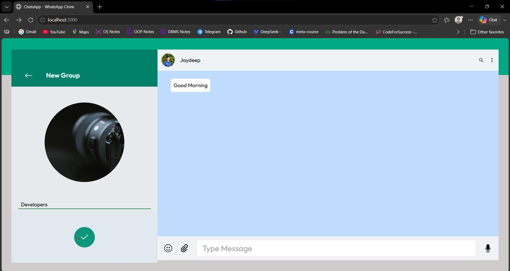 |
| **Group Created Successfully** | 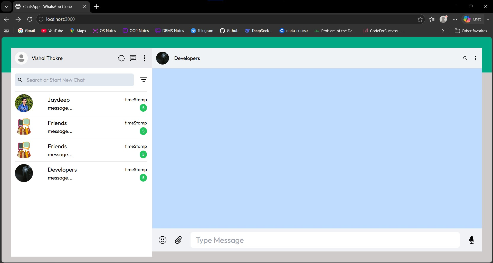 |
| **Real-Time Group Sync** | 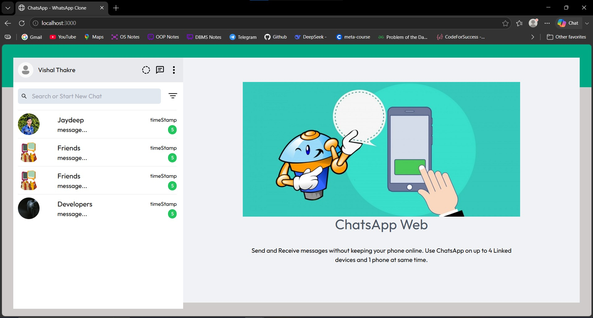 |
| **WhatsApp-style Status List** | 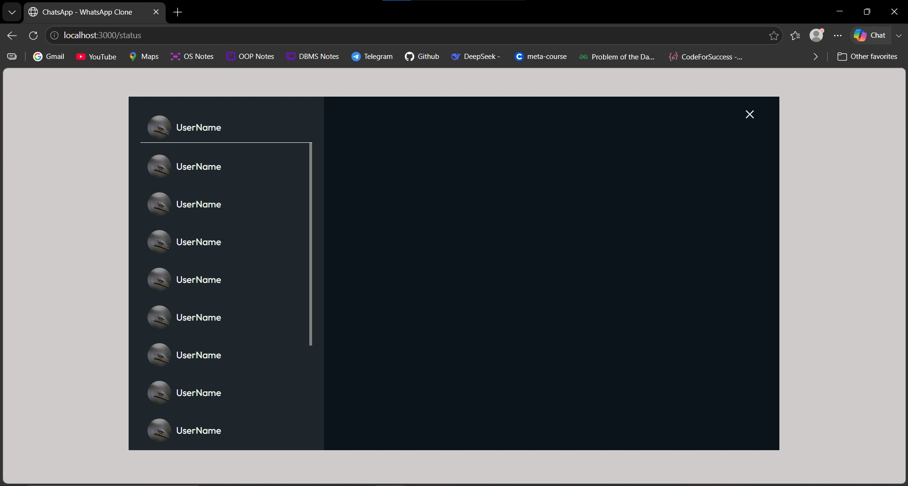 |
| **Status Story Viewer** | 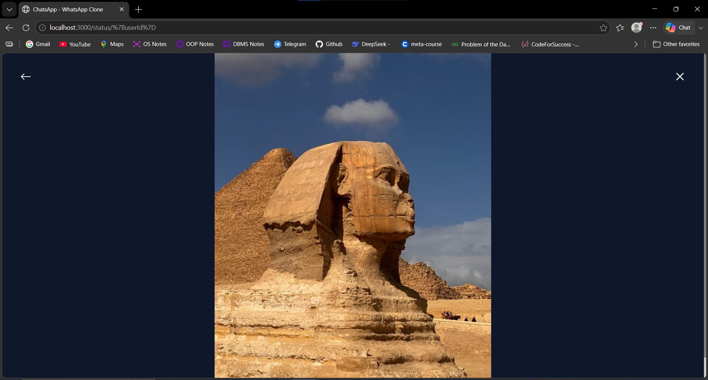 |
| **Profile Settings** | 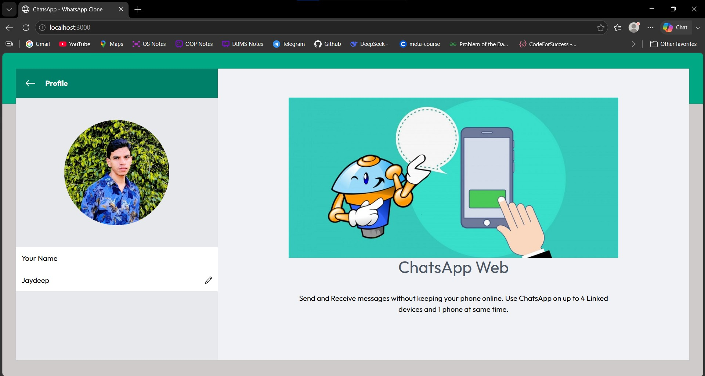 |
| **Navigation & Options Menu** | 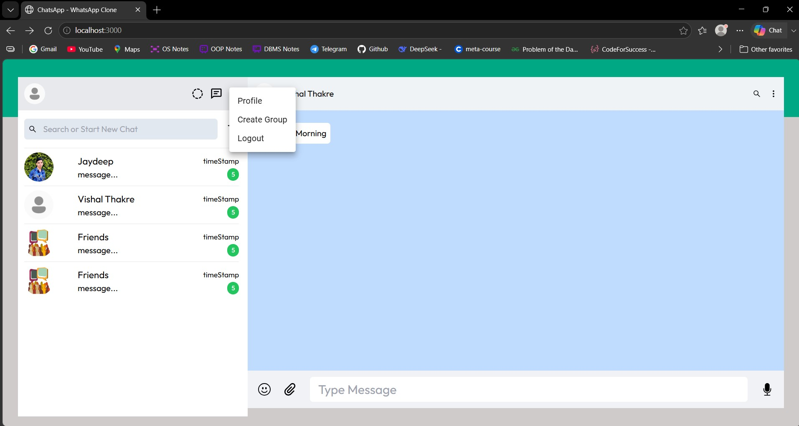 |

---

## 🛠️ Tech Stack

### Backend
- **Framework:** Spring Boot 3.4.3
- **Language:** Java 17
- **Security:** Spring Security, JWT (jjwt 0.11.1)
- **Database / ORM:** MySQL 8.0+, Spring Data JPA, Hibernate 6
- **Real-Time Engine:** Spring WebSocket (STOMP + SockJS)

### Frontend
- **Framework:** React.js 18
- **State Management:** Redux + Redux Thunk
- **Routing:** React Router v6
- **Styling:** Tailwind CSS & Material-UI (MUI)
- **WebSocket Client:** StompJS & SockJS-client
- **Cloud Storage:** Cloudinary API

---

## 🚀 Getting Started

### Prerequisites
- **Java SDK 17+**
- **Node.js 18+** & **npm**
- **MySQL Server 8.0+** running on port `3306`

---

### 1. Database Setup
Create a MySQL database named `chatsapp`:
```sql
CREATE DATABASE chatsapp;
```

Update your database credentials in `ChatsApp/src/main/resources/application.properties` if needed:
```properties
spring.datasource.url=jdbc:mysql://localhost:3306/chatsapp
spring.datasource.username=root
spring.datasource.password=your_password
```

---

### 2. Backend Setup (Spring Boot)
Navigate to the backend directory and run:
```bash
cd ChatsApp
./mvnw spring-boot:run
```
*(Or run `ChatsAppApplication.java` from IntelliJ IDEA / Eclipse / VS Code).*  
The backend will start at: `http://localhost:5454`

---

### 3. Frontend Setup (React)
In the root directory, install dependencies and start the React development server:
```bash
npm install
npm start
```
The application will launch in your browser at: `http://localhost:3000`

---

## 📂 Project Structure

```
chatsApp/
├── ChatsApp/                   # Spring Boot Backend
│   ├── src/main/java/com/chatsApp/
│   │   ├── config/             # Security, JWT, WebSocket & CORS configuration
│   │   ├── controller/         # REST & WebSocket Controllers
│   │   ├── model/              # JPA Entities (User, Chat, Message)
│   │   ├── repository/         # Data Repositories
│   │   ├── service/            # Business Logic
│   │   └── ChatsAppApplication.java
│   └── pom.xml
│
├── src/                        # React Frontend
│   ├── Components/
│   │   ├── HomePage.jsx        # Main Chat Interface
│   │   ├── ChatCard/           # Conversation Preview Card
│   │   ├── MessageCard/        # Chat Bubble Component
│   │   ├── Group/              # Group Creation & Member Selection
│   │   ├── Profile/            # Profile Management & Cloudinary Upload
│   │   ├── Register/           # Signin & Signup Pages
│   │   └── Status/             # Stories / Status Viewer
│   ├── Redux/                  # Redux Store, Actions & Reducers
│   └── App.js
├── package.json
└── README.md
```

---

## 👤 Author

**Jaydeep Jogdand**  
- GitHub: [@Geeker02](https://github.com/Geeker02)  
- Email: jaydeepjogdand@gmail.com